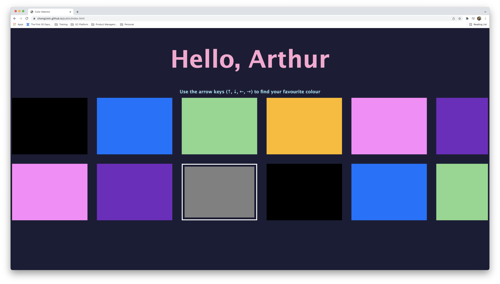
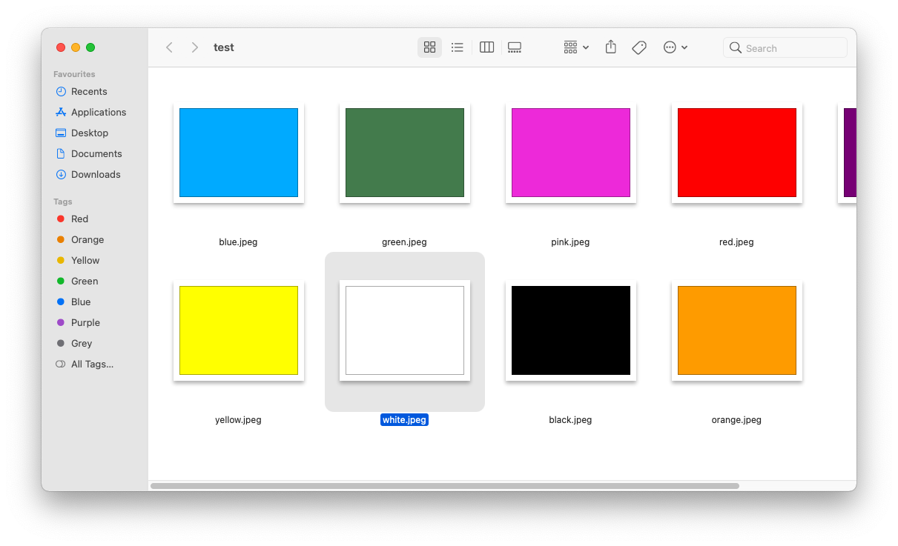

# Objective
I designed this simple application for my son, who occasionally gets frustrated not being able to get his intended video when using the Youtube Kids TV app.

A screenshot of the app is provided below, and the 5 buttons used to navigate the app are the 4 arrow keys and an `Ok` button to confirm the video to play.

:format(png)/cdn.vox-cdn.com/uploads/chorus_image/image/54442173/kidstv.0.png)

While operating a remote control and the YouTube Kids App is fairly straightforward for an adult, it can be difficult for toddlers (separate discussion on whether toddlfers should watch TV) as it involves multiple skills listed below.
1. Understanding the 4 directions (up, down, left, right) and the `Ok` button
2. Aiming the remote control at the TV
3. Pressing the remote control buttons with the right amount of force
4. Hand-eye coordination for the above steps
5. Understanding which is the currently focused video on the YouTube Kids App (see Further Thoughts section below.)

A screenshot of the current product is below, and can also be accessed at [https://chongzixin.github.io](https://chongzixin.github.io)



# Installation Setup

1. Install required modules
```
npm install
```

2. Run the project. This command will start webpack in serve mode, so that all changes to typescript files will automatically be packaged into a single `bundle.js`. Note that for development, this `bundle.js` file is only in memory and won't be visible. 
```
npm run start
```

# Other Notes
- This repo is a submodule on `chongzixin.github.io`. GitHub Actions have been setup to automatically trigger a submodule update on the parent repository whenever there is a push to the main branch.

- When releasing to production, run `npm run build` so that the latest `bundle.js` file gets created. **IMPORTANT**


# Other Solutions Considered
- **Excel** - the UIUX for training navigation keys is fundamentally a grid view. Hence Excel came to mind as the "mother of spreadsheets". However, we can't constrain the arrow key navigation to 2 rows (as in the YouTube Kids App), so it is easy for the user to "lose" where we want them to try if they press and hold the down arrow and reach Row 2000 when we want them to navigate within Rows 1 and 5.
- **Mac Finder** - I considered downloading these thumbnails as images and then display them as Gallery view on Mac Finder. This achieves the part about training to use the arrow keys, however does not address problem (5) above, because it is quite easy to identify the currently focused thumbnail on Mac Finder (admittedly untested with my toddler).



We landed on building an application for the following reasons
- Closer resemblance to the YouTube Kids TV app - refer to limitations specified in Excel and Mac Finder above.
- Enhancing my technical skills - Exploring GitHub Pages, putting my TypeScript training into practice

# Success Measure
- The child not being pissed when using the remote (by observation)
- The child taking the shortest path to the video he wants to watch

# Todo (just ideas for now, not in order of priority)
- ~~Textbox for name~~ (implemented on 4 December 2022)
- Arrow keys on screen
- Mobile/Tablet support

# Further thoughts about the YouTube Kids TV App

It's unclear if it's meant for kids to self-service, or use under supervision of adults. Assuming the former, then the following are suggestions for improvements
- Making the currently selected video more obvious - as seen from the screenshot above, a thumbnail is focus is slightly larger in size compared to the others. While this difference is easy to spot for an adult used to other TV and mobile apps, it is less obvious for young children. A clearer differentiation helps the user navigate better.
- Countdown timer to limit screen-time - parents usually want to limit the amount of screen time the child is exposed to. Allowing a setting to specify the amount of time the app can be launched at one go will be useful to "enforce" this. A further enhancement could be to specify based on number of videos, although there is a limit to its value given the varying length of videos on the app. We also acknowledge that it can be worked around by just restarting the app, this workaround is easy for older children but not for young ones.